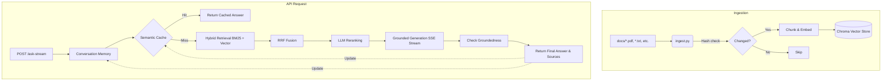
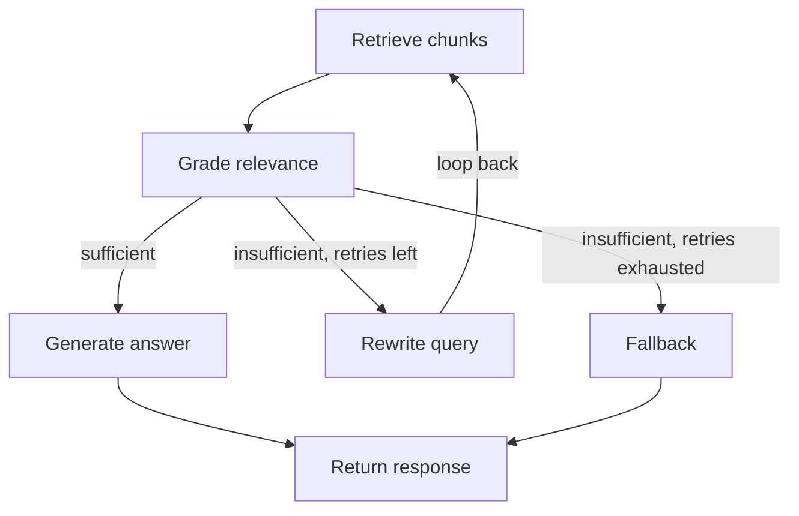

# RAG Capstone — Document Q&A API

A FastAPI service that answers questions grounded in a local set of documents,
using a Retrieval-Augmented Generation (RAG) pipeline. Started as a focused
2-day MVP; extended with agentic self-correction, hybrid retrieval,
reranking, standardized evaluation, observability, and multi-cloud model
support -- see "JD coverage" below for exactly what maps to what.

## JD coverage

Mapped directly against a "RAG Pipelines & Vector Intelligence" JD section
covering: *ingestion, chunking, embeddings, indexing, vector search, hybrid
retrieval, and grounding... vector databases... rerankers, retrieval
evaluators, and freshness pipelines.*

| JD requirement | Where it lives | Notes |
|---|---|---|
| Ingestion | `app/ingest.py` | Multi-format (pdf/txt/md/csv/html/docx), per-file error isolation |
| Embeddings | `app/providers.py` | Groq (FastEmbed local ONNX) or Vertex AI, config-switchable |
| Vector search | `app/retrieval.py` `hybrid_retrieve()` | Chroma `similarity_search` |
| **Hybrid retrieval** | `app/retrieval.py` `hybrid_retrieve()` | BM25 + vector, fused via Reciprocal Rank Fusion |
| Grounding | `app/rag.py` `generate_answer()`, `check_groundedness()` | Strict context-only prompting + LLM-as-judge hallucination check |
| Vector database integration | `app/ingest.py`, `app/retrieval.py` | ChromaDB; pgvector is a documented, scoped-out next step |
| **Rerankers** | `app/retrieval.py` `rerank()` | LLM-based listwise reranking (see file header for why, vs. cross-encoder) |
| **Retrieval evaluators** | `eval.py`, `eval_ragas.py` | Custom LLM-as-judge + standardized RAGAS metrics (faithfulness, relevancy, precision, recall) |
| **Freshness pipelines** | `app/ingest.py` (hash + manifest) | Incremental re-ingestion: unchanged files skipped, changed files replaced, new files added |

Also present, beyond this specific JD section: a self-correcting LangGraph
agent loop (`app/agent.py`), LangSmith tracing, and GCP Vertex AI + Cloud Run
deployment -- see the rest of this README.

## Architecture



### Hybrid retrieval + reranking

`app/retrieval.py` replaces plain vector search with a two-stage pipeline,
used by both `/ask` and `/ask-agentic` (via `app/rag.py`'s `retrieve()`):

1. **Hybrid candidate retrieval** — BM25 (lexical/keyword) and vector
   (semantic) search run over a candidate pool 3x larger than the final
   top-k, fused with Reciprocal Rank Fusion. Catches both exact-term
   queries (product codes, IDs -- vector search alone is often weak here)
   and paraphrase/synonym queries (BM25 alone is weak here).
2. **LLM reranking** — the fused candidate pool is re-scored by an LLM in
   a single listwise call, narrowing down to the final top-k actually
   passed to generation. Falls back safely to the pre-rerank order if the
   LLM's response is malformed, rather than failing the request.

See the module docstring in `app/retrieval.py` for the full reasoning,
including why an LLM reranker was chosen over a cross-encoder here.

### Agentic RAG (`POST /ask-agentic`)

`app/agent.py` wraps retrieval in a self-correcting LangGraph loop instead of
a single pass. This is the "agentic" upgrade over `/ask`:



- **Grade**: an LLM call judges whether retrieved context is actually
  sufficient to answer the question -- strict grading, not a rubber stamp.
- **Rewrite**: on insufficient context, the query is rewritten (different
  phrasing/specificity) and retrieval runs again. Capped at `MAX_RETRIES`
  (2) to prevent infinite loops -- this cap, plus the explicit `retry_count`
  in graph state, is what makes the loop safe to run in production rather
  than a fun-but-dangerous while-loop.
- **Fallback**: if still insufficient after retries, returns an honest
  "I don't have enough information" message instead of letting the LLM
  guess -- the whole point of the groundedness check carried over from `/ask`.
- `/ask` (single-pass) is kept alongside `/ask-agentic` deliberately, so you
  can call both with the same question and compare behavior directly.

**Design decisions:**
- **ChromaDB, not pgvector** — chosen for zero-setup local persistence to fit
  a tight build window. The retrieval interface (`similarity_search`) is
  the same shape as pgvector via LangChain, so swapping the vector store
  later is a config/adapter change, not a rewrite.
- **LLM-as-judge for both groundedness and eval correctness** — a real,
  widely-used technique for evaluating LLM outputs where exact-match scoring
  doesn't work (answers are free text, not fixed strings).
- **Structured JSON-line logging** — every `/ask` and `/ask-agentic` request
  logs the question, answer, sources used, groundedness verdict, retries
  used, and latency. Minimal, but it's a real, queryable monitoring signal.
- **`/ask` (single-pass) and `/ask-agentic` (self-correcting loop) kept
  side by side** — lets you call both with the same question and compare
  behavior directly, e.g. when grading fails and a query gets rewritten.
- **Provider abstraction (`app/providers.py`)** — every LLM/embeddings call
  goes through `get_llm()`/`get_embeddings()`. Switching between Groq and
  Vertex AI is a `.env` change (`MODEL_PROVIDER`), not a code change --
  see "Switching to Vertex AI" below.

## Setup

```bash
uv sync --frozen
cp .env.example .env
# edit .env and set your API key
```

## Usage

**1. Build the index**: Run ingestion locally to build `chroma_db/`:
   ```bash
   uv run python -m app.ingest
   ```
Supports `.pdf`, `.txt`, `.md`, `.csv`, `.html`, and `.docx` -- drop any mix
of these into `docs/` (including subfolders) and re-run.

**This is incremental by default** (the "freshness pipeline"): each file's
content is hashed and tracked in `chroma_db/ingest_manifest.json`.
Re-running `uv run python -m app.ingest` after adding a new file only embeds the
new file; unchanged files are skipped entirely (no re-embedding cost), and
a changed file has its old chunks deleted and replaced. One bad file
(corrupt PDF, malformed doc) is recorded and skipped, not a fatal crash for
the whole batch -- check the printed summary for `Failed:` count and details.

Force a full re-embed of every file regardless of whether it changed (e.g.
after switching `MODEL_PROVIDER`, since embeddings from different providers
aren't compatible with each other in the same collection):
```bash
uv run python -m app.ingest --force
```

**2. Start the API**:
```bash
uv run uvicorn app.main:app --reload
```

**3. Query it** — open http://127.0.0.1:8000/docs for the interactive
Swagger UI, or:
```bash
curl -X POST http://127.0.0.1:8000/ask \
  -H "Content-Type: application/json" \
  -d '{"question": "How long is the refund window?"}'
```

**4. Run the custom eval harness**: Custom LLM-as-judge (fastest, cheapest, validates core correctness and groundedness):
```bash
uv run python eval.py
```

**5. Run the RAGAS eval harness**: Standardized RAGAS metrics (slower, more expensive, deep analysis of retrieval/generation):
```bash
uv run python eval_ragas.py
```
This scores four standardized RAGAS metrics: **Faithfulness** (hallucination
check against retrieved context), **ResponseRelevancy** (does the answer
address the question), **LLMContextPrecisionWithoutReference** (was
retrieval precise), and **LLMContextRecall** (did retrieval surface what
was needed). See the compatibility note at the top of `eval_ragas.py` if
`import ragas` fails on a different environment -- it's a real, currently-
open version conflict between `ragas` and recent `langchain-community`
releases, worked around with a small shim, not a bug in this code.

## Switching to Vertex AI (instead of Groq)

All LLM/embeddings calls go through `app/providers.py`, so this is a config
change, not a code change:

```bash
# in .env
MODEL_PROVIDER=vertexai
GCP_PROJECT_ID=your-gcp-project-id
GCP_LOCATION=us-central1

# authenticate locally (one-time)
gcloud auth application-default login
```

**Important:** the vector store's embeddings are tied to whichever provider
created them. If you switch `MODEL_PROVIDER` after already running
`uv run python -m app.ingest` with the other provider, re-run with `--force`
(`uv run python -m app.ingest --force`) to re-embed everything under the new
provider -- mixing embedding spaces from two different providers in the
same collection silently produces bad retrieval, not an error.

## Deploying to GCP (Cloud Run + Vertex AI)

Uses GCP's free trial ($300 credit, 90 days) -- enough for portfolio-project
usage. Requires the `gcloud` CLI installed and authenticated.

```bash
# 1. One-time project setup
gcloud auth login
gcloud config set project YOUR_PROJECT_ID
gcloud services enable run.googleapis.com aiplatform.googleapis.com \
    cloudbuild.googleapis.com secretmanager.googleapis.com \
    artifactregistry.googleapis.com

# 2. Ingest documents LOCALLY first -- chroma_db/ must exist in the build
#    context before building the image (see Dockerfile comments for why
#    ingestion doesn't run at build time).
uv run python -m app.ingest

# 3. Create Artifact Registry repository
gcloud artifacts repositories create rag-repo \
    --repository-format=docker \
    --location=us-central1

# 4. Build and push the container image via Cloud Build
gcloud builds submit --tag us-central1-docker.pkg.dev/YOUR_PROJECT_ID/rag-repo/rag-capstone:latest

# 5. Store API keys securely in Secret Manager
echo -n "your-api-key" | gcloud secrets create rag_api_key --data-file=-
echo -n "your-groq-key" | gcloud secrets create groq_api_key --data-file=-
gcloud secrets add-iam-policy-binding rag_api_key --member="serviceAccount:YOUR_PROJECT_NUMBER-compute@developer.gserviceaccount.com" --role="roles/secretmanager.secretAccessor"
gcloud secrets add-iam-policy-binding groq_api_key --member="serviceAccount:YOUR_PROJECT_NUMBER-compute@developer.gserviceaccount.com" --role="roles/secretmanager.secretAccessor"

# 6. Deploy using declarative yaml
# Open cloudrun-groq.yaml (if using Groq) or cloudrun-vertexai.yaml (if using Vertex AI)
# Replace YOUR_PROJECT_ID with your actual project ID
gcloud run services replace cloudrun-groq.yaml
```

**If using Vertex AI (4a):** the Cloud Run service's default compute
service account needs the `roles/aiplatform.user` IAM role, or Vertex AI
calls will fail with a permissions error:
```bash
gcloud projects add-iam-policy-binding YOUR_PROJECT_ID \
  --member="serviceAccount:YOUR_PROJECT_NUMBER-compute@developer.gserviceaccount.com" \
  --role="roles/aiplatform.user"
```
(Find `YOUR_PROJECT_NUMBER` via `gcloud projects describe YOUR_PROJECT_ID`.)

## Project structure

```text
app/
  agent.py      # self-correcting LangGraph loop (grade / rewrite / fallback)
  cache.py      # semantic caching for repeated questions
  config.py     # centralized env/config loading
  ingest.py     # load -> chunk -> embed -> persist to Chroma
  main.py       # FastAPI endpoints (/, /upload, /ask, /ask-agentic) + UI serving + logging
  memory.py     # conversation history and contextual query rewriting
  metrics.py    # observability and prometheus-style metrics
  middleware.py # API key auth, CORS, rate limiting
  providers.py  # model provider factory (Groq / Vertex AI)
  rag.py        # single-pass retrieval, grounded generation, groundedness check
  retrieval.py  # hybrid retrieval + LLM reranking
  streaming.py  # Server-Sent Events (SSE) streaming
  ui.html       # frontend interface
docs/           # source documents (sample included)
tests/          # unit and integration tests
eval.py         # custom eval harness (LLM-as-judge, correctness + groundedness)
eval_ragas.py   # RAGAS eval harness (faithfulness, relevancy, precision, recall)
  cloudrun-groq.yaml    # Declarative Cloud Run configuration for Groq
  cloudrun-vertexai.yaml # Declarative Cloud Run configuration for Vertex AI
Dockerfile
pyproject.toml
```

## What this covers vs. a production system

Built deliberately as an MVP within a 2-day window. What's implemented is
real and working, not stubbed — but scoped down from a production system:

**Implemented:**
- End-to-end RAG: chunking, embeddings, vector storage, retrieval, grounded generation
- **Self-correcting agentic loop** (`/ask-agentic`): grade retrieved context,
  rewrite and retry on insufficient context (capped retries), graceful
  fallback -- see `app/agent.py`
- Groundedness / hallucination check on every answer
- Two eval harnesses: custom LLM-as-judge (`eval.py`) and standardized
  RAGAS metrics -- faithfulness, response relevancy, context precision,
  context recall (`eval_ragas.py`)
- **LangSmith tracing** -- every agent node (`retrieve`, `grade`, `rewrite`,
  `generate`, `fallback`) is wrapped with `@traceable`, so a full request
  shows up in LangSmith as one root trace with each step nested inside,
  including the actual LLM calls, latency, and token usage per step.
  Off by default (`LANGSMITH_TRACING=false`); flip it on in `.env`.
- Structured request logging (question, answer, sources, latency, retries used)
- Source citation in every response (which chunks were used)
- **Multi-cloud model provider support**: Groq (default) or GCP Vertex AI,
  switchable via config -- see `app/providers.py` and "Switching to Vertex AI"
- **GCP Cloud Run deployment**: Dockerfile adapted for Cloud Run's dynamic
  `$PORT`, plus full `gcloud` deploy commands for both provider paths --
  see "Deploying to GCP" above

**Explicitly deferred (next steps, in priority order):**
1. **pgvector** — swap ChromaDB for Postgres + pgvector for a
   production-grade, horizontally scalable vector store (relevant once this
   needs to scale past a single-instance Cloud Run deployment).
2. **Asynchronous Ingestion Worker** — currently, the `/upload` endpoint runs ingestion synchronously in a thread. While this works well for demos and small files, for production at scale, document processing should be decoupled into a separate worker queue (e.g. Cloud Run Jobs + Pub/Sub) to prevent HTTP timeouts on massive files.
