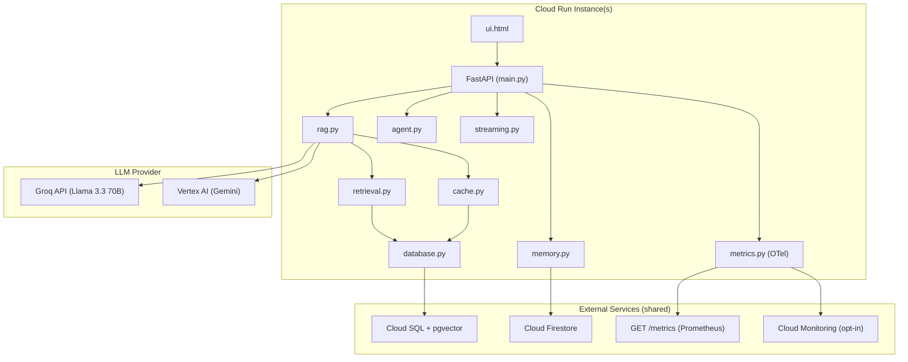

# Postgres Vector Migration — Full Changelog

> [!NOTE]
> This documents everything the **Claude Code terminal session** (`postgres-vector-migration`) changed in the `rag-capstone` project. These changes are currently **uncommitted** (580 lines added, 268 removed across 18 files).

---

## Summary

The session executed a **Phase 2 production migration** that replaced three in-process/local subsystems with external, shared services suitable for multi-instance Cloud Run:

| Subsystem | Before (Phase 1) | After (Phase 2) |
|---|---|---|
| **Vector store** | Local ChromaDB (`chroma_db/`) | PostgreSQL + pgvector (Cloud SQL) |
| **Conversation memory** | In-process Python dict | Google Cloud Firestore |
| **Metrics** | Hand-rolled dataclass | OpenTelemetry (Prometheus + Cloud Monitoring) |

---

## File-by-File Changes

### 1. [app/config.py](file:///c:/Users/psaik/Downloads/Empy%20Folder/rag-capstone/app/config.py)

**Added settings for the three new backends:**

| Setting | Default | Purpose |
|---|---|---|
| `DATABASE_URL` | `""` (via `_get_secret`) | Cloud SQL connection string |
| `DATABASE_POOL_MIN` | `2` | psycopg2 pool min connections |
| `DATABASE_POOL_MAX` | `10` | psycopg2 pool max connections |
| `EMBEDDING_DIMENSION` | `384` | `VECTOR(N)` column width (384 for Groq/FastEmbed, 768 for Vertex AI) |
| `FIRESTORE_COLLECTION` | `"conversation_sessions"` | Firestore collection name |
| `SESSION_TTL_HOURS` | `24` | Conversation expiry |
| `OTEL_GCP_EXPORT` | `"false"` | Opt-in Cloud Monitoring push |

Also added `GCP_PROJECT_ID` to the `.env.example` comment explaining it's needed for Firestore/Cloud Monitoring even on the Groq path.

---

### 2. [app/database.py](file:///c:/Users/psaik/Downloads/Empy%20Folder/rag-capstone/app/database.py) — **NEW module (333 lines)**

Centralized PostgreSQL + pgvector layer replacing ChromaDB. Key components:

- **Connection pool** — `psycopg2.pool.ThreadedConnectionPool` with configurable min/max, lazy-initialized
- **`get_conn()`** — context manager that checks out a connection, registers pgvector type, commits/rollbacks
- **`init_db()`** — executes [db_schema.sql](file:///c:/Users/psaik/Downloads/Empy%20Folder/rag-capstone/app/db_schema.sql) idempotently (all `IF NOT EXISTS`)
- **Chunk operations** — `get_chunk_count()`, `upsert_chunks()`, `delete_chunks_by_source()`
- **Manifest operations** — `get_manifest()`, `upsert_manifest_entry()` (per-file, immediate write)
- **`hybrid_search()`** — single SQL query: vector similarity (`<=>` operator) + full-text (`tsvector/tsquery`) + RRF fusion (k=60)
- **Cache operations** — `cache_get()` (cosine similarity threshold), `cache_set()`
- **`close_pool()`** — clean shutdown, called from FastAPI lifespan

---

### 3. [app/db_schema.sql](file:///c:/Users/psaik/Downloads/Empy%20Folder/rag-capstone/app/db_schema.sql) — **NEW file (51 lines)**

Three tables:

```sql
-- chunks: document chunks with vector embedding + auto-maintained tsvector
CREATE TABLE chunks (
    id BIGSERIAL PRIMARY KEY,
    source TEXT, content TEXT, embedding VECTOR({EMBEDDING_DIMENSION}),
    content_tsv TSVECTOR GENERATED ALWAYS AS (to_tsvector('english', content)) STORED,
    content_hash TEXT, metadata JSONB, ingested_at TIMESTAMPTZ
);
-- + IVFFlat index on embedding, GIN index on content_tsv, UNIQUE on (source, content_hash)

-- semantic_cache: cached Q&A pairs for similarity lookup
CREATE TABLE semantic_cache (...);

-- ingest_manifest: per-file hash tracking for incremental re-ingestion
CREATE TABLE ingest_manifest (source TEXT PRIMARY KEY, content_hash TEXT, ...);
```

`{EMBEDDING_DIMENSION}` is templated by `init_db()` from config (384 or 768).

---

### 4. [app/memory.py](file:///c:/Users/psaik/Downloads/Empy%20Folder/rag-capstone/app/memory.py) — **Rewritten (127 lines)**

**Before:** In-process `dict` — each Cloud Run instance had its own divergent history; restart lost everything.

**After:** Firestore-backed with fail-open design:

- **`_get_client()`** — lazy Firestore client. Returns `None` (not an error) if no `GCP_PROJECT_ID` and no `FIRESTORE_EMULATOR_HOST`
- **`add_to_history()`** — saves Q&A turn, capped at 5 turns per session, sets `expires_at` for Firestore TTL
- **`contextualize_question()`** — reads history, uses LLM to rewrite follow-up questions as standalone
- All Firestore errors are caught and logged as warnings — degrades to "no history" rather than crashing

---

### 5. [app/metrics.py](file:///c:/Users/psaik/Downloads/Empy%20Folder/rag-capstone/app/metrics.py) — **Rewritten (96 lines)**

**Before:** Hand-rolled dataclass with in-memory counters, JSON endpoint.

**After:** Real OpenTelemetry instruments:

- **PrometheusMetricReader** — always on, zero config, backs `GET /metrics` (Prometheus text format)
- **CloudMonitoringMetricsExporter** — opt-in (`OTEL_GCP_EXPORT=true`), pushes to Cloud Monitoring every 60s
- Same `record_*()` public API so call sites in `main.py` didn't change:
  - `record_request(endpoint)`, `record_error(endpoint)`, `record_latency(ms)`
  - `record_groundedness(verdict)`, `record_empty_retrieval()`, `record_agent_retry()`

---

### 6. [app/retrieval.py](file:///c:/Users/psaik/Downloads/Empy%20Folder/rag-capstone/app/retrieval.py) — **Updated (133 lines)**

- `hybrid_retrieve()` now calls `database.hybrid_search()` (single SQL query) instead of maintaining a separate in-process BM25 index
- Still returns `LangChain Document` objects so `rerank()` and `rag.py` are unchanged
- `rerank()` and `retrieve_with_hybrid_and_rerank()` logic unchanged

---

### 7. [app/ingest.py](file:///c:/Users/psaik/Downloads/Empy%20Folder/rag-capstone/app/ingest.py) — **Updated (206 lines)**

- Calls `database.init_db()` at the start of `run()` (idempotent — safe for first-ever run against a fresh DB)
- Manifest is now read/written via `database.get_manifest()` / `database.upsert_manifest_entry()` instead of local JSON file
- Chunks upserted via `database.upsert_chunks()` instead of ChromaDB
- Changed files trigger `database.delete_chunks_by_source()` before re-upserting
- Removed `rank_bm25` and `chromadb` imports (no longer dependencies)

---

### 8. [app/main.py](file:///c:/Users/psaik/Downloads/Empy%20Folder/rag-capstone/app/main.py) — **Updated (451 lines)**

- **`lifespan`**: calls `database.init_db()` on startup, `database.close_pool()` on shutdown
- **`/ready`**: calls `database.get_chunk_count()` instead of ChromaDB heartbeat
- **`/metrics`**: returns `prometheus_client.generate_latest()` (Prometheus text format) instead of JSON
- **Imports**: `database` replaces `chromadb`-related modules; added `prometheus_client`

---

### 9. [Dockerfile](file:///c:/Users/psaik/Downloads/Empy%20Folder/rag-capstone/Dockerfile) — **Updated (51 lines)**

- Added `apt-get install libpq5` for psycopg2 PostgreSQL client library
- **Removed** `chroma_db/` COPY — documents are now in external Postgres
- Added note: run `uv run python -m app.ingest` with `DATABASE_URL` configured post-deploy
- Still pre-downloads FastEmbed model at build time

---

### 10. [cloudrun-groq.yaml](file:///c:/Users/psaik/Downloads/Empy%20Folder/rag-capstone/cloudrun-groq.yaml) — **Updated (70 lines)**

- Added `run.googleapis.com/cloudsql-instances` annotation for Cloud SQL Auth Proxy sidecar
- Added `DATABASE_URL` secret mount from Secret Manager
- Added `GCP_PROJECT_ID` env var (needed for Firestore + Cloud Monitoring even on Groq path)
- Added `OTEL_GCP_EXPORT: "true"`

---

### 11. [cloudrun-vertexai.yaml](file:///c:/Users/psaik/Downloads/Empy%20Folder/rag-capstone/cloudrun-vertexai.yaml) — **Updated (72 lines)**

- Same Cloud SQL Auth Proxy + `DATABASE_URL` secret mount
- Added `EMBEDDING_DIMENSION: "768"` (Vertex AI's `text-embedding-005` is 768-dim vs Groq's 384)
- Added `OTEL_GCP_EXPORT: "true"` and `GCP_PROJECT_ID`

---

### 12. [pyproject.toml](file:///c:/Users/psaik/Downloads/Empy%20Folder/rag-capstone/pyproject.toml) — **Updated (66 lines)**

**New dependencies added:**

| Package | Purpose |
|---|---|
| `google-cloud-firestore>=2.28.0` | Conversation memory backend |
| `opentelemetry-api==1.44.0` | OTel API (pinned) |
| `opentelemetry-sdk==1.44.0` | OTel SDK (pinned) |
| `opentelemetry-exporter-prometheus==0.65b0` | Prometheus metrics reader |
| `opentelemetry-exporter-gcp-monitoring==1.14.0a0` | Cloud Monitoring push |
| `pgvector>=0.3.6` | pgvector Python adapter |
| `prometheus-client>=0.21.0` | Prometheus text exposition |
| `psycopg2-binary>=2.9.9` | PostgreSQL driver |

**Removed dependencies:**

| Package | Reason |
|---|---|
| `chromadb==1.5.9` | Replaced by PostgreSQL + pgvector |
| `langchain-chroma==1.1.0` | No longer needed |
| `rank-bm25==0.2.2` | BM25 now runs in Postgres via tsvector |

**Ruff update:** Added `"G201"` to ignore list (the project uses `logger.error(..., exc_info=True)` deliberately).

---

### 13. [.env.example](file:///c:/Users/psaik/Downloads/Empy%20Folder/rag-capstone/.env.example) — **Updated (70 lines)**

Added documented sections for:
- Database (Cloud SQL + pgvector): `DATABASE_URL`, pool settings, `EMBEDDING_DIMENSION`
- Firestore: `FIRESTORE_COLLECTION`, `SESSION_TTL_HOURS`, emulator host
- Metrics: `OTEL_GCP_EXPORT`

---

### 14. [CLAUDE.md](file:///c:/Users/psaik/Downloads/Empy%20Folder/rag-capstone/CLAUDE.md) — **Updated (197 lines)**

Complete rewrite of the Architecture section documenting:
- PostgreSQL + pgvector as the vector store (with Cloud SQL rationale)
- `EMBEDDING_DIMENSION` and provider switching implications
- Firestore-backed memory with fail-open pattern
- OpenTelemetry metrics with Prometheus + Cloud Monitoring dual readers
- Module map updated for all new/changed modules
- Deployment section updated for Cloud SQL Auth Proxy sidecar

---

### 15. [README.md](file:///c:/Users/psaik/Downloads/Empy%20Folder/rag-capstone/README.md) — **Updated**

Deployment guide updated with:
- Cloud SQL instance setup and Auth Proxy
- Secret Manager entries: `groq_api_key`, `database_url`, `rag_api_key`
- Firestore TTL configuration
- Updated architecture description

---

### 16. [tests/test_ingest.py](file:///c:/Users/psaik/Downloads/Empy%20Folder/rag-capstone/tests/test_ingest.py) — **Updated**

Updated mocks to patch `database.` functions instead of ChromaDB.

---

### 17. [docs/task.md](file:///c:/Users/psaik/Downloads/Empy%20Folder/rag-capstone/docs/task.md) — **DELETED (71 lines)**

The task tracking file was removed.

---

### 18. `uv.lock` — **Updated**

Lock file regenerated to reflect the new dependency set (137 lines of diff).

---

## New Architecture Diagram



---

## Live Verification Results

All changes were **verified against real infrastructure** (Docker Postgres + Firestore emulator), not just mocks:

| Test | Result | Details |
|---|---|---|
| Multi-turn contextualization | ✅ Pass | Confirmed by reading raw Firestore documents via emulator REST API |
| Session state survives restart | ✅ Pass | Killed API process & restarted — same session history still in Firestore |
| Metrics reset on restart | ✅ Pass | `/metrics` counters correctly reset to zero after restart (request-local, not persisted) |
| Unit tests | ✅ 27/27 pass | Full test suite clean |
| Lint | ✅ Clean | `ruff check .` passes |

> [!NOTE]
> An initial "vague follow-up answer" during testing turned out to be **LLM quality variance** on an ambiguous question ("How long is it?"), not a code bug — confirmed by retesting with clearer phrasing and inspecting the raw Firestore data directly.

Three real bugs were caught during live Phase 1/2 testing that mocks alone would have missed. The project preference is for live infra testing (Docker Postgres/Firestore, real curl calls) over trusting mocks alone.

---

## Project Phase Status

| Phase | Status | Git |
|---|---|---|
| Phase 0 (initial RAG service) | ✅ Complete | Pushed to `main` |
| Phase 1 (PostgreSQL + pgvector migration) | ✅ Complete | Pushed to `main` |
| Phase 2 (Firestore memory + OpenTelemetry metrics) | ✅ Complete | Commit in progress (user instructed Claude Code to commit) |

---

## Context

This is a **portfolio project for a job search** (AI Engineer / GenAI roles). The development follows a phase-by-phase working style with live infra verification at each stage.
